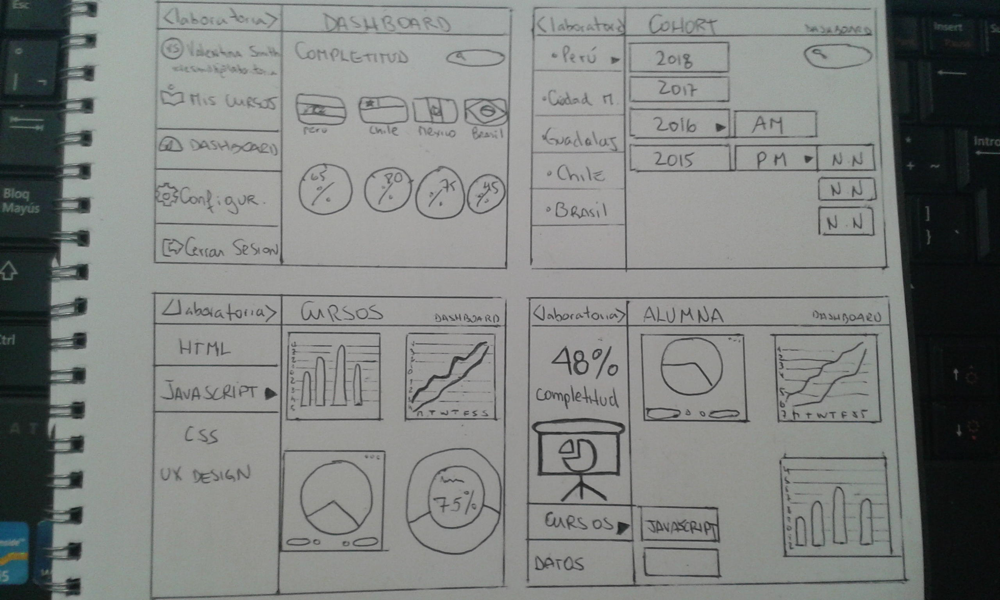
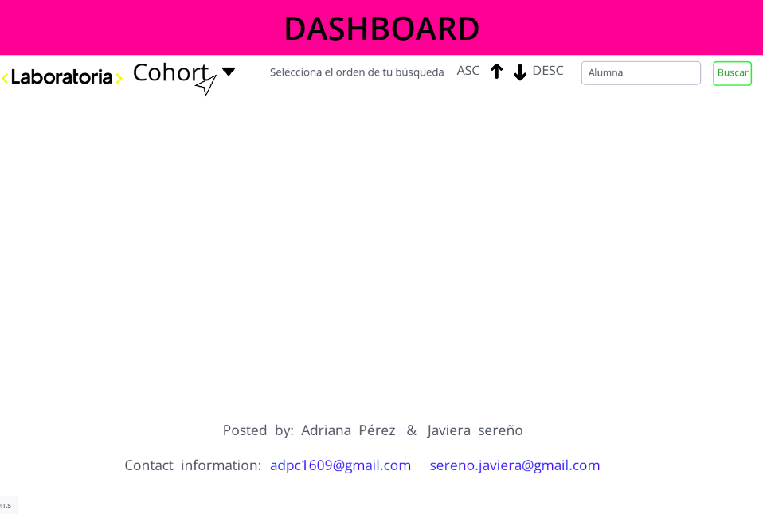
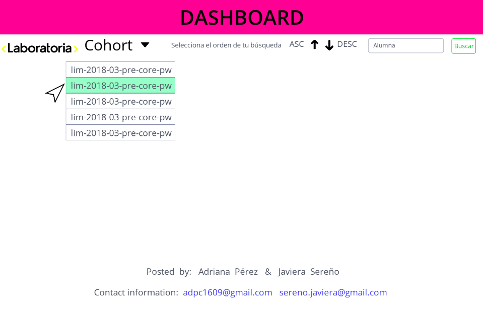
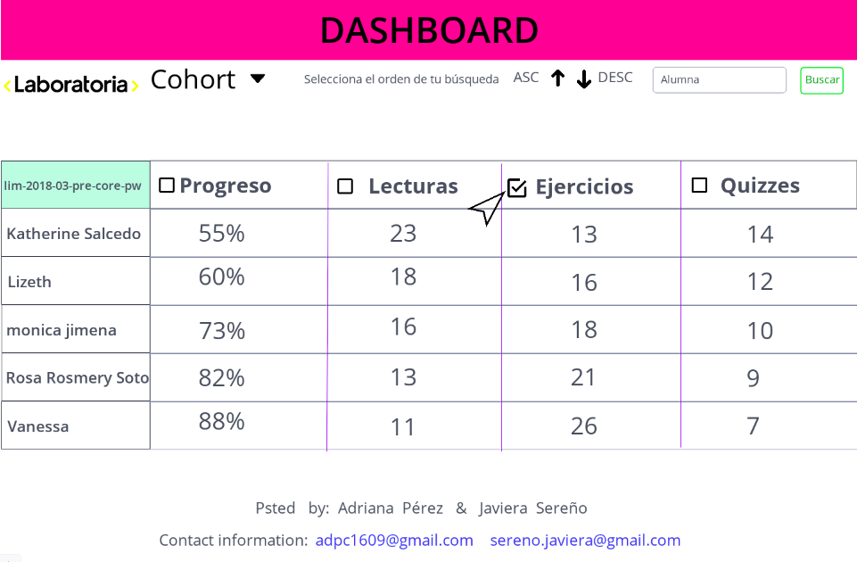
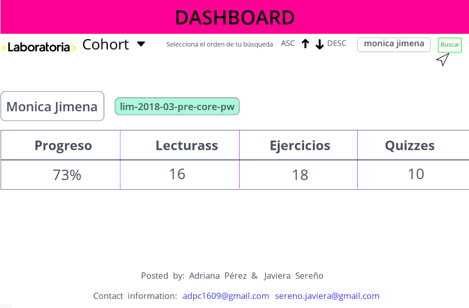
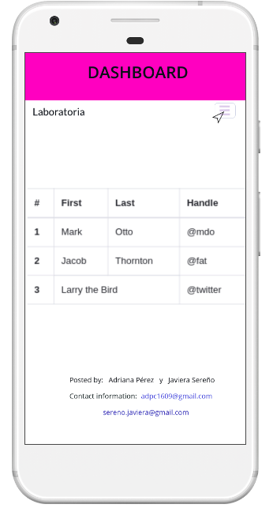
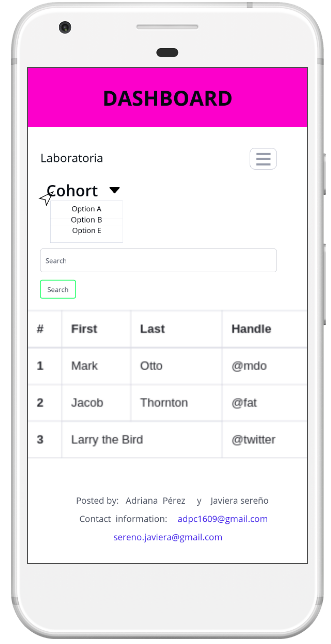

# Data Dashboard

## User Experience Design

###  Definición del producto

Nuestro equipo pensó que era necesario y muy práctico realizar un Data Dashboard para facilitarle a nuestros usuarios el trabajo que ejercen día a día.
Para una completa definición del producto entrevistamos a Valentina smith, Traning Manager de Laboratoria sede Santiago, y pudimos captar lo que relamente necesitaba.
 
 #### sus requerimientos fueron los siguientes:

 - Visualizar la completitud de cada curso.
 - visualizar la completitud de cada alumna.
 - visualizar el progreso que ha tenido cada alumna en los cursos             impartidos.
- Ver progreso por cohort y sede.
 - Tener un buscador para alumna.
 - En lo posible gráficos claros.
 - colores de la empresa.
 - Diseño amigable y con fácil funcionalidad.

 #### Prototipo de baja fidelidad (sketch)

 Aqui presentaremos una muestra en papel de lo que se asemeja según nosotras a los requerimientos de nuestra cliente. Los valores dados en las gráficas no son reales, solo están ahi para dar una idea de como se verá en un futuro. 

### Prototipo de alta fidelidad (FIGMA)

Aqui podrás ver la interfaz de usuario de nuestro producto con los colores de la empresa.

Aqui verás la interfaz en version Mobile.

